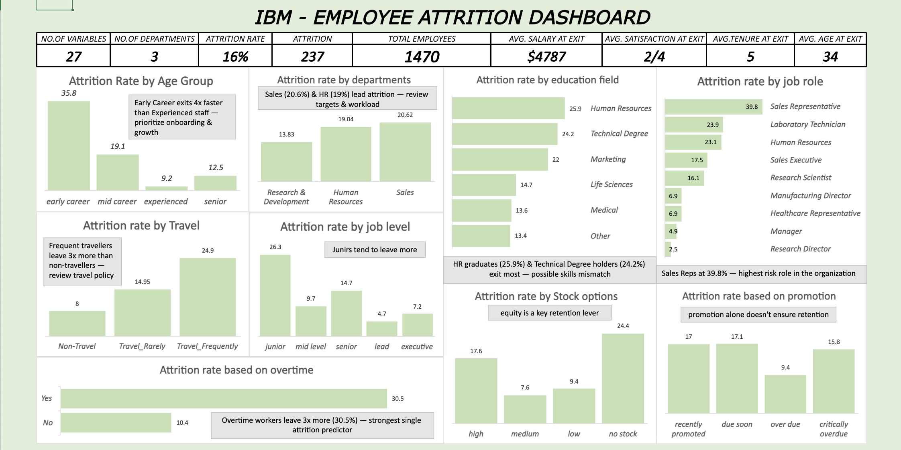

# IBM HR Employee Attrition Dashboard

## 📌 Project Overview
An end-to-end HR Analytics project analyzing employee attrition patterns 
using the IBM HR Analytics dataset. Built entirely in Microsoft Excel — 
covering data cleaning, column decoding, feature engineering, pivot 
analysis, and a dashboard with business recommendations.

---

## 🎯 Business Problem
The company is experiencing a **16% attrition rate**, losing 237 out of 
1,470 employees — above industry benchmark. The goal was to identify 
which employee segments are most at risk and recommend data-driven 
retention strategies.

---

## 📂 Dataset
- **Source:** [IBM HR Analytics Employee Attrition & Performance — Kaggle](https://www.kaggle.com/datasets/pavansubhasht/ibm-hr-analytics-attrition-dataset)
- **Rows:** 1,470 employees
- **Columns:** 35 (reduced to 28 after cleaning)

---

## 🧹 Data Cleaning Steps
- Removed 7 columns: `Monthly Rate`, `Daily Rate`, `Hourly Rate`, 
  `Employee Count`, `Standard Hours`, `Over18`, `Employee Number`
- Decoded numeric columns: `Education`, `JobLevel`, `JobSatisfaction`, 
  `EnvironmentSatisfaction`, `WorkLifeBalance`, `PerformanceRating`, 
  `StockOptionLevel`, `JobInvolvement`, `RelationshipSatisfaction`
- Created banded columns: `Age Group`, `Distance From Home`, 
  `Total Working Years`, `Years At Company`, `Years In Current Role`, 
  `Years Since Last Promotion`, `Percent Salary Hike`, 
  `Num Companies Worked`

---

## 📊 Dashboard KPIs
| KPI | Value |
|-----|-------|
| Total Employees | 1,470 |
| Total Attrition | 237 |
| Attrition Rate | 16% |
| Avg. Salary at Exit | $4,787 |
| Avg. Satisfaction at Exit | 2/4 |
| Avg. Tenure at Exit | 5 years |
| Avg. Age at Exit | 34 years |

---

## 📈 Charts & Insights
| Chart | Key Insight |
|-------|-------------|
| Attrition by Age Group | Early Career exits 4x faster than Experienced staff |
| Attrition by Department | Sales (20.6%) & HR (19%) lead attrition |
| Attrition by Education Field | HR graduates (25.9%) exit most |
| Attrition by Job Role | Sales Reps at 39.8% — highest risk role |
| Attrition by Travel | Frequent travellers leave 3x more than non-travellers |
| Attrition by Job Level | Junior staff (26.3%) most at risk |
| Attrition by Stock Options | No stock options = 24.4% attrition |
| Attrition by Promotion | Recently promoted still leave at 17% |
| Attrition by Overtime | Overtime workers leave 3x more (30.5%) |

---

## 💡 Recommendations
1. **Cap overtime** — introduce compensation or comp-off for overtime workers
2. **Redesign Sales incentives** — review targets and introduce mental health support
3. **Early Career retention program** — mentorship, clear promotion path, regular check-ins
4. **Extend stock options to all levels** — equity significantly reduces attrition
5. **Hybrid options for frequent travellers** — reduce unnecessary travel
6. **Mandatory promotion review every 3 years** — no employee waits beyond 3 years

---

## 🛠 Tools Used
- Microsoft Excel
- Pivot Tables & Pivot Charts
- Power Query
- DAX-style calculated fields

---

## 👩‍💻 Author
**Sainaba Hanan**  
Data Analyst | Kozhikode, Kerala  
[LinkedIn](https://linkedin.com/in/sainaba-hanan-accountant-dataanalyst) | 
[Portfolio](https://sainaba-hanan.github.io) | 
[GitHub](https://github.com/sainaba-hanan)
